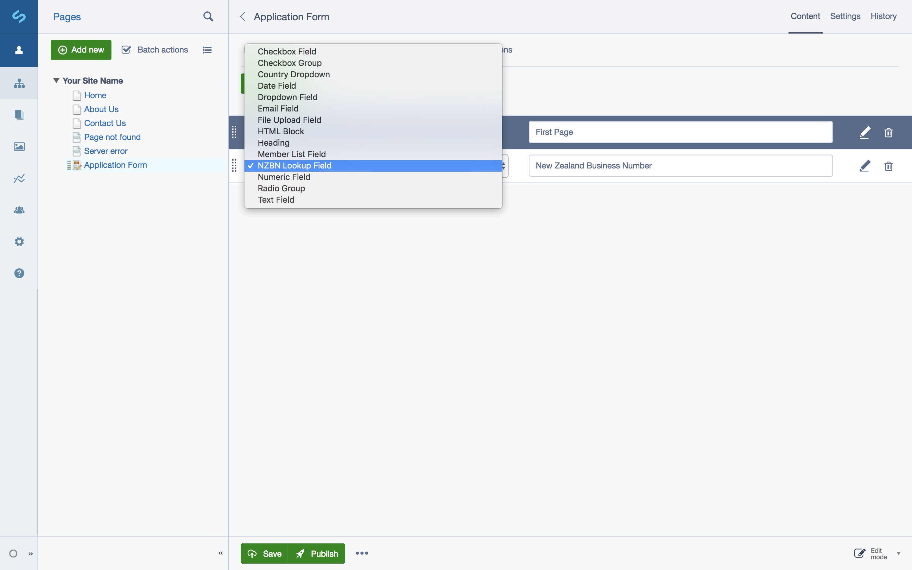
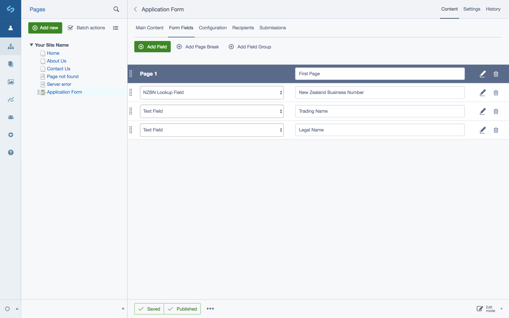
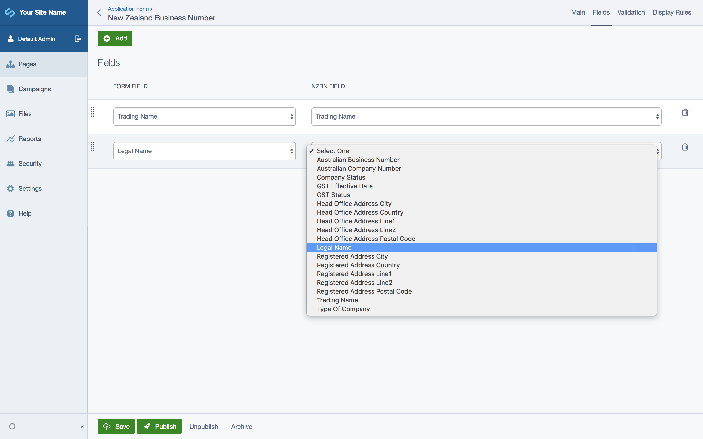

# User Guide

1. Add a NZBN Lookup Field to your User Defined Form.

2. Add fields that you want the NZBN Lookup Field to pre-populate, for example, Trading Name. Make sure to save the form afterwards.

3. Configure the NZBN Lookup Field to pre-populate the fields you set up in the previous step.

4. All done :thumbsup:.
